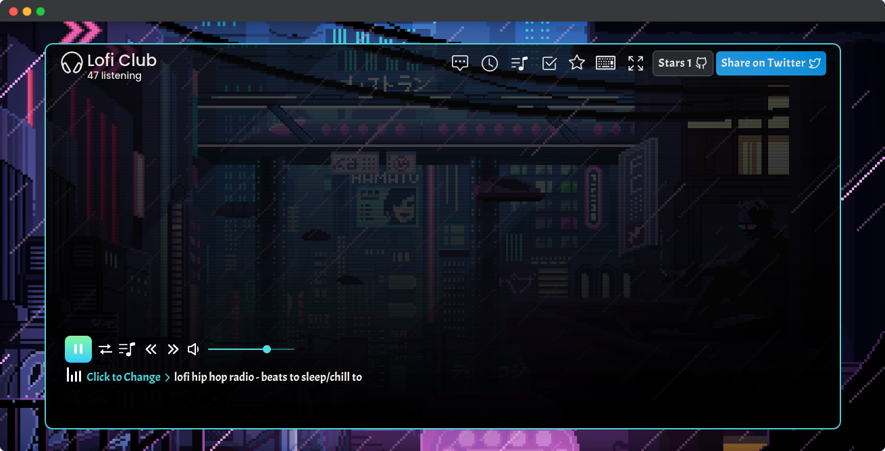
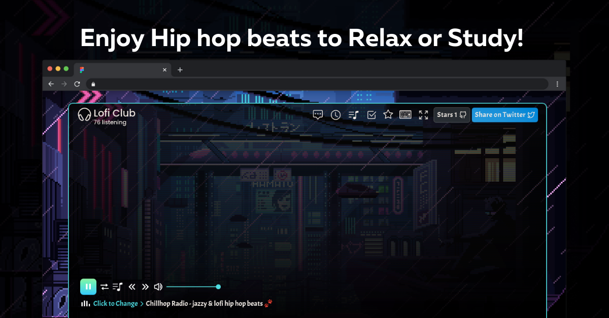

<p align="center">
  <a href="https://loficlub.now.sh/">
    
  </a>
</p>
<h1 align="center">Lofi Club</h1>

<p align="center">
<a href="https://github.com/saviomartin/loficlub/blob/master/LICENSE" target="blank">

</a>
<a href="https://github.com/saviomartin/loficlub/fork" target="blank">

</a>
<a href="https://github.com/saviomartin/loficlub/stargazers" target="blank">

</a>
<a href="https://github.com/saviomartin/loficlub/issues" target="blank">

</a>
<a href="https://github.com/saviomartin/loficlub/pulls" target="blank">

</a>
<a href="https://twitter.com/intent/tweet?text=Check%20out%20loficlub.now.sh%20by%20@SavioMartin7%E2%9A%A1%EF%B8%8F%0D%0A%0AThe%20best%20place%20to%20enjoy%20Hip%20hop%20beats%20to%20Relax%20or%20Study!%20%F0%9F%8E%A7%20Give%20it%20a%20try!%20You%27ll%20love%20it!%20%F0%9F%94%A5%0D%0A%0A%23lofi%20%23chillbeats"></a>

</p>

<p align="center"></p>

<p align="center">
    <a href="https://loficlub.now.sh/" target="blank">View Demo</a>
    ·
    <a href="https://github.com/saviomartin/loficlub/issues/new/choose">Report Bug</a>
    ·
    <a href="https://github.com/saviomartin/loficlub/issues/new/choose">Request Feature</a>
</p>

### Need amazing lofi music to relax or study?

Lofi Club is made just for you. Lofi Club is super flexible and have more than 17 awesome tracks. The app runs 24/7 enabling you to relax all time. Lofi Club comes with more amazing features like live chat, pomodoro, stared playlist and much more. So, sit back and enjoy! 🙌

## 🚀 Demo

<a href="https://loficlub.now.sh/" target="blank">

</a>

Try the app: [Lofi Club](https://loficlub.now.sh/)

## 🧐 Features

Provides a great space for you to relax or just chill. Comes with more than 17 tracks. Dark minimalist UI makes it much more amazing. Live Chat, pomodoro timer, control by keyboard, playlist, fullscreen mode makes the app super better that its competitors.

- **17+ tracks**
- **Distraction free music player**
- **Option to switch between tracks**
- **Control by Keyboard**
- **Realtime live count**
- **Live Chat**
- **Pomodoro Timer**
- **Stared Music Playlist**
- **Todolist**
- **Full Screen Mode**
- **Elegant animations**
- **PWA, Installable app**
- **Dark mode**
- **Minimal UI, Lightning Fast**
- **Fully Responsive**

Lofi Club is productive enough to make you relaxed or chilled ✨️

## 🛠️ Installation Steps

1. Clone the repository

```bash
git clone https://github.com/saviomartin/loficlub.git
```

2. Change the working directory

```bash
cd loficlub
```

3. Install dependencies

```bash
npm install
```

4. Run the app

```bash
npm start
```

🌟 You are all set!

## 🍰 Contributing

Please contribute using [GitHub Flow](https://guides.github.com/introduction/flow). Create a branch, add commits, and [open a pull request](https://github.com/saviomartin/loficlub/compare).

Please read [`CONTRIBUTING`](CONTRIBUTING.md) for details on our [`CODE OF CONDUCT`](CODE_OF_CONDUCT.md), and the process for submitting pull requests to us.

## 💻 Built with

- [React](https://reactjs.org/)
- [Tailwind](https://tailwindcss.com/)
- [Material UI](http://material-ui.com/): for styling and Icons
- [Animate.css](https://animate.style/): for smooth Animations
- [AOS](https://michalsnik.github.io/aos/): for scroll animations
- [react-router-dom](https://reactrouter.com/web/guides/quick-start): for routing
- [Vercel](https://aws.amazon.com/amplify/): for hosting

...much more

## 🛡️ License

This project is licensed under the MIT License - see the [`LICENSE`](LICENSE) file for details.

## 🦄 Deploy

[](https://vercel.com/new/project?template=https://github.com/saviomartin/loficlub)
[](https://app.netlify.com/start/deploy?repository=https://github.com/saviomartin/loficlub)
[](https://cloud.digitalocean.com/apps/new?repo=https://github.com/saviomartin/loficlub)

## 🙏 Support

This project needs a 🌟 from you

<hr>
<p align="center">
Developed with ❤️ in India 🇮🇳 
</p>
